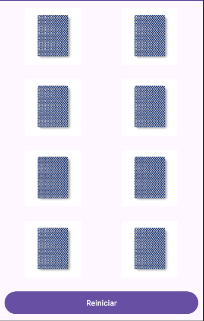
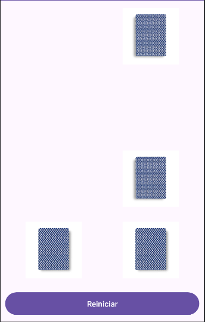

# Juego de Memoria

Juego de memoria clásico en el que el usuario debe encontrar todas las parejas de cartas iguales. Todas las cartas comienzan boca abajo y se giran al seleccionarlas.

## Descripción
Este proyecto consiste en el desarrollo de un juego de memoria cuyo objetivo es encontrar todas las parejas de cartas iguales. El jugador debe recordar la posición de las cartas para completar el juego con el menor número de intentos posible.

El proyecto ha sido desarrollado como práctica académica.

## Funcionalidades
- Cartas ocultas al inicio de la partida
- Giro de cartas al seleccionarlas
- Comprobación de parejas
- Reinicio de la partida

## Tecnologías utilizadas
- Lenguaje: Java
- Entorno de desarrollo: Android Studio

## Instrucciones de uso
1. Ejecutar la aplicación.
2. Seleccionar dos cartas para girarlas.
3. Si las cartas son iguales, desaparecerán.
4. Si son diferentes, volverán a ocultarse.
5. El juego finaliza cuando todas las parejas han sido encontradas.

## Capturas de pantalla

Pantalla de inicio:

Durante el juego:

